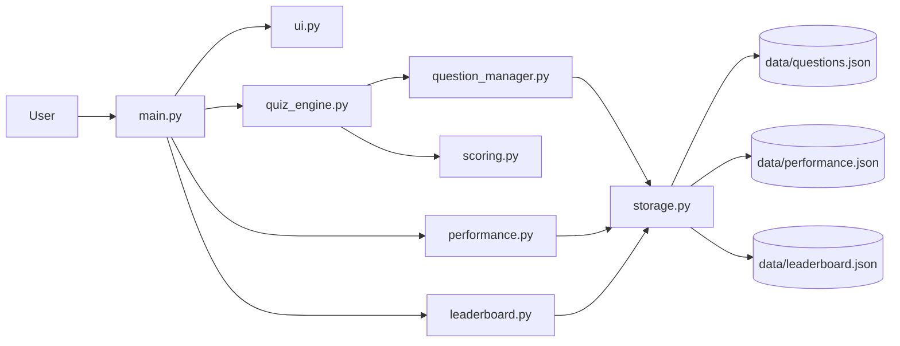

# Quiz Master System Architecture

Quiz Master is a standard-library Python console application. `main.py` owns the interaction loop and coordinates the presentation and domain modules. `ui.py` renders the requested framed two-column dashboard and the remaining screens. `quiz_engine.py` conducts a session; `question_manager.py` validates, filters, and samples question records; `scoring.py` calculates answer points and result summaries. `performance.py` aggregates attempts, while `leaderboard.py` sorts saved scores. `storage.py` handles JSON files, and `config.py` centralizes paths and rules.

The application has no network service or third-party dependency. JSON files are local and human-readable. Invalid or empty JSON returns the caller's safe default; missing files are initialized automatically.

## Data storage design

Question records have `id`, `question`, four `options` keyed A-D, `answer`, `category`, and `difficulty`. Attempt records include player, category, difficulty, question count, correct and incorrect counts, score, maximum score, accuracy, and UTC timestamp. The performance file is the source for aggregate statistics; leaderboard entries are separately sorted by score and then accuracy.
