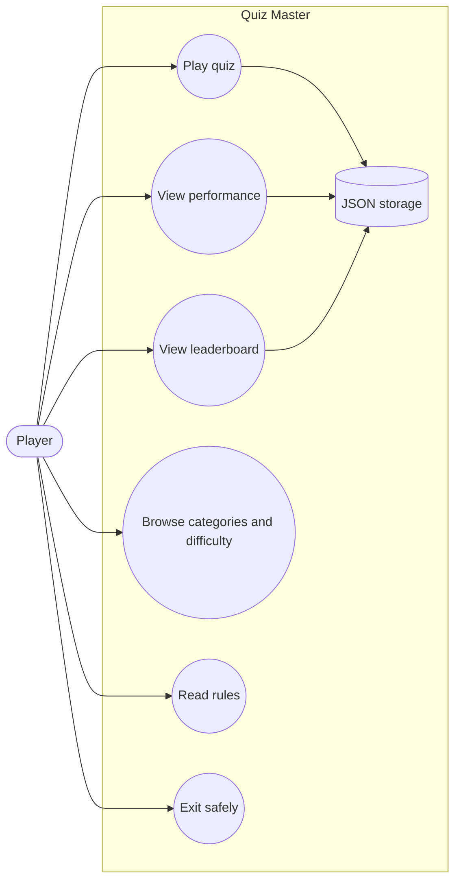
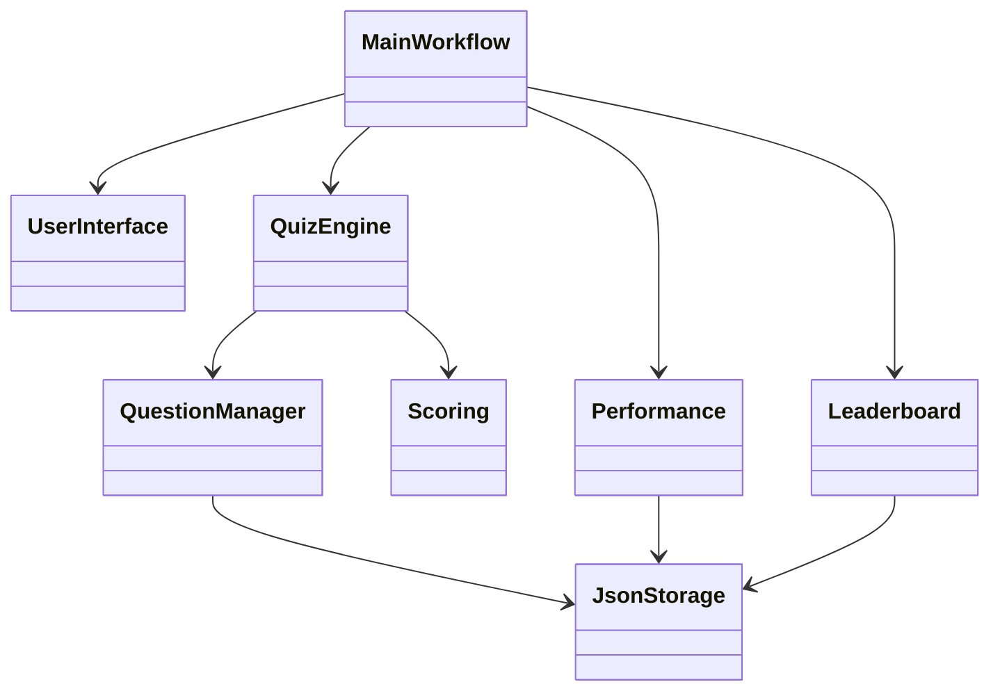
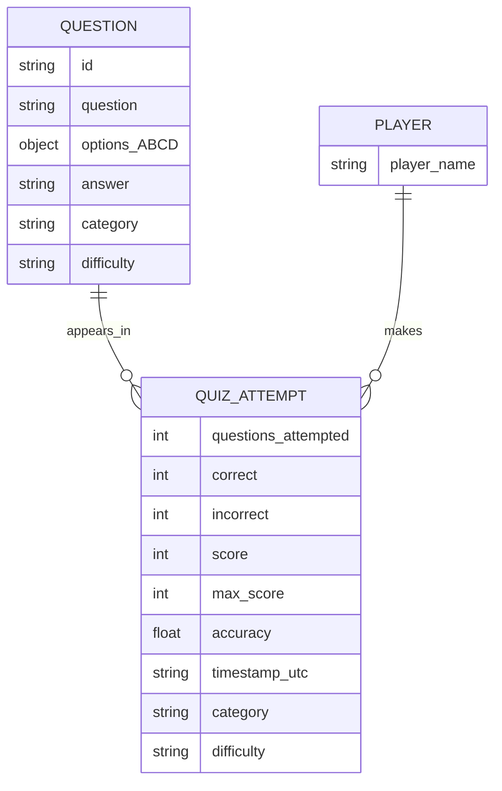

# Quiz Master Diagrams

## Use Case Diagram — Player Actions and Quiz Services

## Component Diagram — Module Collaborations

## Data Storage Design — Local JSON Records

The diagram names mirror the actual JSON fields and Python module boundaries. The JSON files are arrays of question or attempt objects; there is no separate player database.
