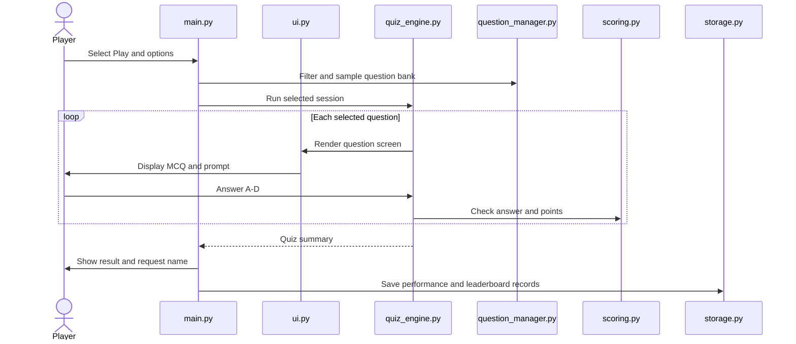

# Quiz Master User Workflow

1. The two-column dashboard offers Play, Your Stats, Leaderboard, Categories, Difficulty, How to Play, and Exit.
2. Play prompts for a difficulty, category, and question count. The selected bank is filtered before questions are sampled.
3. For each question, the player chooses A, B, C, or D. Invalid answer text is requested again. Correct answers earn the configured points for the selected difficulty; incorrect answers earn zero.
4. The result screen reports attempted, correct, incorrect, score, maximum score, accuracy, and difficulty.
5. The player name and attempt metadata are appended to local performance and leaderboard JSON files.
6. Stats aggregate saved performance records. The leaderboard sorts attempts by score and accuracy, and shows at most ten entries.

## Invalid and empty input behavior

Menu choices are range-checked and retried. Category/difficulty choices support `0` to return. Answer input is limited to A-D. A question set with no matching records yields a clear message and returns to the menu. A first run reports that no attempts exist rather than showing sample statistics.
